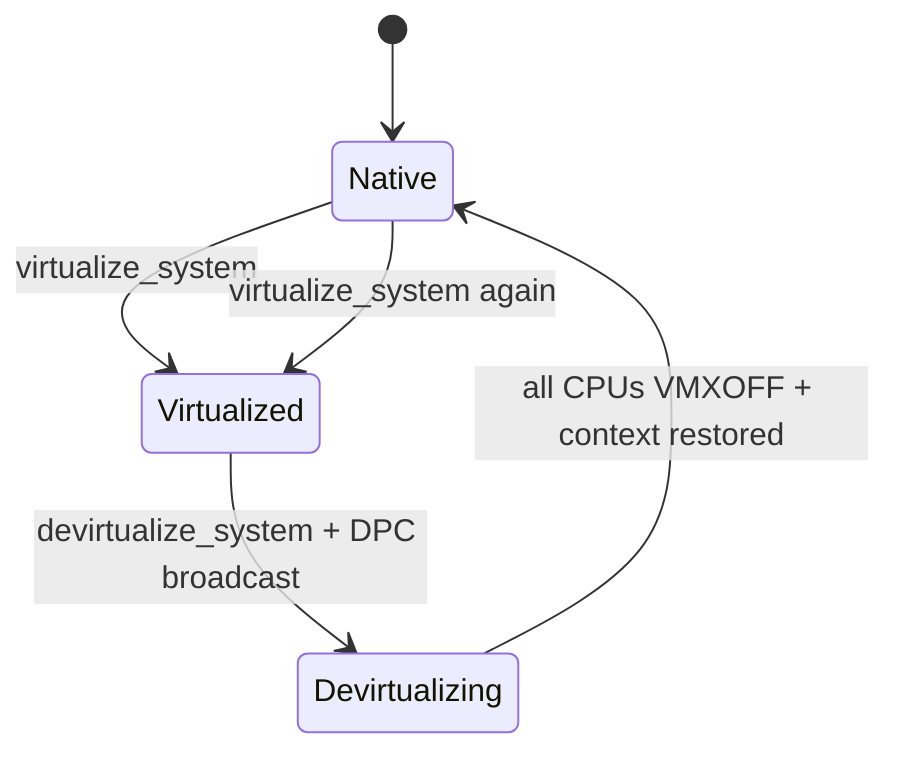

# Intel Devirtualize / Re-virtualize Design Spec

**Date:** 2026-06-14  
**Status:** Approved (2026-06-14)  
**Plan:** [`docs/superpowers/plans/2026-06-14-intel-devirtualize.md`](../plans/2026-06-14-intel-devirtualize.md)
**Scope:** hvcore Intel VMX first; AMD stub only. Platform API entry + HyperDbg-style `VMCALL` / DPC per-core trigger.

## Goal

Add the ability to **fully exit** hardware-assisted virtualization on all logical processors and **re-enter** later via the existing `virtualize_system()` API. Symmetric lifecycle:

```
Native → virtualize_system() → Virtualized → devirtualize_system() → Native → virtualize_system() → …
```

After `devirtualize_system()` returns, the system runs in native (non-VMX) mode with no Barevisor CPUID signature. After a subsequent `virtualize_system()`, behavior matches a fresh first-time virtualization.

## Non-Goals (v1)

- AMD SVM devirtualize implementation (trait stub / `unimplemented!` acceptable)
- Arbitrary guest-initiated devirt (hypercall honored only while `devirtualize_system()` broadcast is in progress)
- Freeing the 256 KB per-CPU host stacks (acceptable leak across cycles)
- Changing `SharedHostData` between re-virtualize cycles (reuse first value)
- UEFI unload path (Windows `win_hv` integration is in scope for platform wiring only)

## Trigger Model (HyperDbg-style: platform entry + VMCALL + DPC broadcast)

### Public entry (platform API)

```rust
// hvcore/src/lib.rs
pub fn devirtualize_system();
```

Callers: Windows driver unload / IOCTL handler, future UEFI teardown. Mirrors HyperDbg `VmxPerformTermination()` — one top-level API, not a free-standing guest hypercall API.

### Per-core trigger (`VMCALL_VMXOFF` hypercall + DPC broadcast)

Port HyperDbg `VmxTerminate` / `DpcRoutineTerminateGuest` / `KeGenericCallDpc`:

```rust
// hypercall.rs — new constant (Barevisor numbering, not HyperDbg 0x2)
pub const HV_HYPERCALL_VMXOFF: u64 = 6;

pub fn vmxoff() -> bool {
    issue(HV_HYPERCALL_VMXOFF, 0, 0, 0, 0).0 == HV_HYPERCALL_SUCCESS
}
```

**`devirtualize_system()` flow:**

```
1. guard: skip if not virtualized
2. DEVIRT_IN_PROGRESS = true          // gate: reject stray guest VMCALLs
3. ept_hook::uninstall_all() + INVEPT(all-context)
4. platform_ops::broadcast_on_all_processors(|| hypercall::vmxoff())
       // Windows: KeGenericCallDpc — parallel per-core, mirrors DpcRoutineTerminateGuest
       // each core: guest executes VMCALL → VM-exit → handle_vmcall → perform_vmxoff → asm ret to guest
5. reset_global_state()
6. DEVIRT_IN_PROGRESS = false
```

**Per-core sequence (mirrors `VmxTerminate`):**

```
DPC on CPU N (guest context):
  AsmVmxVmcall / hypercall::vmxoff()
    → VM-exit (VMCALL)
    → handle_vmcall: HV_HYPERCALL_VMXOFF + DEVIRT_IN_PROGRESS
    → perform_vmxoff()        // VmxPerformVmxoff
    → exit_vmx_to_guest asm   // AsmVmxoffHandler: ret to guest RIP after VMCALL
  // native mode; DPC returns
```

### New `PlatformOps` method

`run_on_all_processors` today migrates the **calling thread** via affinity (sequential). HyperDbg uses **`KeGenericCallDpc`** for parallel per-core execution — required for devirt broadcast.

```rust
// platform_ops.rs
pub trait PlatformOps {
    fn run_on_all_processors(&self, callback: fn());       // existing — keep for virtualize
    fn broadcast_on_all_processors(&self, callback: fn()); // new — DPC on Windows
}
```

| Platform | `broadcast_on_all_processors` implementation |
|----------|---------------------------------------------|
| Windows `win_hv` | `KeGenericCallDpc` + `KeGenericCallDpc` barrier (port `DpcRoutineTerminateGuest` pattern) |
| UEFI | Affinity loop (same as today) or MP Services — acceptable sequential fallback for v1 |

`virtualize_system()` keeps `run_on_all_processors`; only `devirtualize_system()` uses `broadcast_on_all_processors`.

### Hypercall handler rules

In `handle_vmcall`:

```rust
HV_HYPERCALL_VMXOFF => {
    if !DEVIRT_IN_PROGRESS.load(SeqCst) {
        return HV_HYPERCALL_INVALID;  // block arbitrary guest devirt
    }
    // perform_vmxoff — does not return; asm lands guest after VMCALL
}
```

- **Do not** set `guest.regs().rip = info.next_rip` for VMXOFF (HyperDbg skips RIP increment when `IsVmxoffExecuted`).
- `perform_vmxoff` uses HyperDbg RIP rule: `GuestRIP += VMEXIT_INSTRUCTION_LEN` (RIP still points at `VMCALL` when handler runs).

## Current Architecture (Baseline)

```
virtualize_system()
  → run_on_all_processors(|| {
        registers = capture_current()          // RIP = post-capture in callback
        if !hypervisor_present:
            switch_stack(host::main, registers)  // jmp — never returns today
        // guest continues here after VMLAUNCH
    })

host::main(registers) -> !
  → virtualize_core::<Intel>(registers) -> !
       Vmx::enable()      // VMXON
       VmxGuest::new/activate/initialize
       loop { guest.run() → handle VM-exit }
```

Key files: `mod.rs`, `host.rs`, `intel/vmx.rs`, `intel/guest.rs`, `intel/run_guest.S`, `switch_stack.rs`.

## HyperDbg Reference (what we adopt / adapt)

Primary references in [HyperDbg/hyperhv](https://github.com/HyperDbg/HyperDbg):

| HyperDbg symbol | File | Role |
|-----------------|------|------|
| `VmxPerformTermination` | `code/vmm/vmx/Vmx.c` | Global teardown: `EptHookUnHookAll` → broadcast per-core terminate → free EPT / `g_GuestState` |
| `VmxTerminate` | `code/vmm/vmx/Vmx.c` | Per-core: `AsmVmxVmcall(VMCALL_VMXOFF)` from guest |
| `VmxPerformVmxoff` | `code/vmm/vmx/Vmx.c` | Core VMXOFF sequence (order matters — see below) |
| `HvRestoreRegisters` | `code/vmm/vmx/Hv.c` | Restore guest FS/GS base, GDTR, IDTR, DS/ES/SS/FS **before** VMXOFF |
| `AsmVmexitHandler` / `AsmVmxoffHandler` | `code/assembly/AsmVmexitHandler.asm` | VM-exit asm: if VMXOFF done → **do not** `vmresume`; jump to saved guest RIP/RSP |
| `VmxVmexitHandler` | `code/vmm/vmx/Vmexit.c` | Returns `TRUE` when `IsVmxoffExecuted`; skips RIP increment |

**HyperDbg trigger (adopted):** `VMCALL_VMXOFF` per core via `KeGenericCallDpc(DpcRoutineTerminateGuest)`. barevisor maps to `HV_HYPERCALL_VMXOFF` + `broadcast_on_all_processors`. Top-level entry remains `devirtualize_system()` (= `VmxPerformTermination`).

**HyperDbg does not support re-virtualize** — it frees `g_GuestState` and EPT. barevisor adds `EptState::reset()` + second `virtualize_system()` on top of the same teardown core.

### `VmxPerformVmxoff` order (must match)

HyperDbg executes in this exact order; our `intel::devirt::perform_vmxoff` must follow it:

1. **`CR3 ← VMCS_GUEST_CR3`** — SimpleVisor note: host may run with a different CR3 (custom host PT); guest must resume with its own address space. barevisor default shares PT, but custom `SharedHostData.pt` makes this **mandatory**.
2. Read `VMCS_GUEST_RIP` / `VMCS_GUEST_RSP`.
3. **Guest RIP rule:** `GuestRIP += VMEXIT_INSTRUCTION_LEN` — teardown runs inside the `VMCALL` VM-exit handler while RIP still points at `VMCALL` (same as HyperDbg `VmxPerformVmxoff`).
4. Save `(GuestRip, GuestRsp)` into per-CPU `DevirtState` (HyperDbg `VmxoffState`).
5. Set `DevirtState.is_done = true`.
6. **`hv_restore_registers()`** — partial restore before VMXOFF (see checklist below).
7. **Restore XMM0–5 + MXCSR** into hardware **before** `VMXOFF` (HyperDbg: `AsmVmxoffRestoreXmmRegs`; VMXOFF re-enables interrupts; context switch could clobber XMM).
8. `VMCLEAR` current VMCS (SDM §24.11 — required before reuse / exit).
9. `VMXOFF`.
10. **`CR4 &= ~CR4.VMXE`**.

Remaining full guest state (CR0/CR2/CR4, CS/TR/LDTR, SYSENTER MSRs, RFLAGS, GPRs) is restored either in step 6 extension or in the asm jump path — see asm section.

### `HvRestoreRegisters` checklist (before VMXOFF)

Restore from VMCS into **real hardware** (host may have clobbered these via custom host GDT/IDT — PatchGuard-sensitive on Windows):

- `IA32_FS_BASE`, `IA32_GS_BASE`
- `GDTR` (base + limit), `IDTR` (base + limit)
- Segment selectors: `DS`, `ES`, `SS`, `FS`

CS / GS / TR / LDTR bases and access rights stay in VMCS until asm exit; if full native execution fails, extend restore to match `initialize_guest()` field list.

## Target Architecture

```
devirtualize_system()          // VmxPerformTermination
  → guard: skip if not virtualized
  → DEVIRT_IN_PROGRESS = true
  → ept_hook::uninstall_all() + INVEPT(all-context)
  → broadcast_on_all_processors(|| hypercall::vmxoff())   // KeGenericCallDpc
  → reset_global_state()
  → DEVIRT_IN_PROGRESS = false

host loop (changed):
  loop {
      match guest.run() {
          VmExitReason::VmCall(info) => {
              if handle_vmcall(...) triggers VMXOFF {
                  // perform_vmxoff inside handler — does not return
              }
          }
          … other exits …
      }
  }
```

**Key change vs earlier draft:** do **not** return through `host::main` / `switch_stack`. HyperDbg never unwinds the host Rust loop; `AsmVmxoffHandler` sets `RSP`/`RIP` and `ret` into guest. `host::main` remains `-> !`.

## VM-exit handler rules during devirt

Port HyperDbg `VmxVmexitHandler` tail:

- `handle_vmcall` for `HV_HYPERCALL_VMXOFF`: call `perform_vmxoff`, **do not** advance guest RIP (`IncrementRip = FALSE` equivalent).
- When `DevirtState.is_done` is set, asm path must **not** `vmresume` — branch to `exit_vmx_to_guest` (port `AsmVmxoffHandler`).
- `perform_vmxoff` computes return RIP as `VMCS_GUEST_RIP + VMEXIT_INSTRUCTION_LEN` (skip past `VMCALL` opcode).
- After asm `ret`, guest continues at the instruction **after** `VMCALL` in the DPC callback, already in native mode.



## Intel Per-CPU Teardown (`intel::devirt`)

See **HyperDbg `VmxPerformVmxoff` order** above. Implementation split:

| Layer | Function | Notes |
|-------|----------|-------|
| Rust | `perform_vmxoff(guest)` | Steps 1–10; calls asm at end |
| Rust | `hv_restore_registers()` | Port of `HvRestoreRegisters` |
| Rust | `DevirtState` per CPU | `guest_rip`, `guest_rsp`, `is_done` — port of `VMX_VMXOFF_STATE` |
| Asm | `exit_vmx_to_guest` in `run_guest.S` | Port of `AsmVmxoffHandler` |

### Assembly return path (port of `AsmVmxoffHandler`)

Extend `intel/run_guest.S` (not a separate exit-only stub):

```
guest.run() → run_vmx_guest → VM-exit (VMCALL) → .VmExit → ret to Rust
  handle_vmcall(HV_HYPERCALL_VMXOFF) → perform_vmxoff()
  perform_vmxoff() → exit_vmx_to_guest:
      restore GPRs from Registers / stack
      skip XMM slots (already restored in Rust before VMXOFF)
      guest_rsp = DevirtState.guest_rsp
      guest_rip = DevirtState.guest_rip
      mov rsp, guest_rsp
      push guest_rip
      ret                         // land in guest after VMCALL — DPC callback continues
```

HyperDbg clears `RAX` before `ret` after VMCALL VMXOFF to signal success; barevisor may set `guest.regs().rax = HV_HYPERCALL_SUCCESS` in `perform_vmxoff` before asm exit.

### `Extension` trait change

```rust
pub(crate) trait Extension: Default {
    fn enable(&mut self);
    fn disable(&mut self);  // Intel: VMCLEAR + VMXOFF + clear CR4.VMXE; called from perform_vmxoff
}
```

### Per-CPU state storage

HyperDbg uses `g_GuestState[cpu].VmxoffState`. barevisor today keeps `VmxGuest` on the host stack — add a global:

```rust
// intel/devirt.rs
struct DevirtState { guest_rip: u64, guest_rsp: u64, is_done: AtomicBool }
static PER_CPU_DEVIRT: [DevirtState; MAX_CPUS];  // or Vec sized at apic_id::init
```

`exit_vmx_to_guest` reads saved RIP/RSP from this structure (like `VmxReturnStackPointerForVmxoff` / `VmxReturnInstructionPointerForVmxoff`).

## `host::main` and `switch_stack` (unchanged return model)

HyperDbg does **not** unwind the host stack or return from the virtualization entry function. barevisor follows the same model:

- `switch_stack` stays `mov rsp; jmp` — **no** return trampoline.
- `host::main` stays `-> !`.
- After devirt, execution continues in **guest** at RIP after `VMCALL` (inside the DPC/broadcast callback), not by returning from `host::main`.

## Global State Reset (Re-virtualize Support)

| State | Current | After devirt |
|-------|---------|--------------|
| `SHARED_HOST_DATA: Once` | set once | Keep — same data reused on re-virt |
| `SHARED_GUEST_DATA: LazyLock<EptState + MSR bitmap>` | never reset | `ept_state.reset()` — rebuild identity map, clear split pages |
| `HOOKS: Mutex<HookTable>` | persistent | `uninstall_all()` during devirt |
| `APIC_ID_MAP` | init in virtualize | Idempotent re-init OK |
| `DEVIRT_IN_PROGRESS` | new atomic | true only during `broadcast_on_all_processors` window |
| `SYSTEM_VIRTUALIZED` | new atomic bool | false after devirt, true after all CPUs launched |

`virtualize_system()` behavior unchanged for callers:

- If `is_our_hypervisor_present()` in callback → skip `host::main` (already virtualized).
- If not present → enter host path (first time or after devirt).

## Multi-Processor Synchronization

```
devirtualize_system (caller CPU, typically guest/driver context):
│
├─ DEVIRT_IN_PROGRESS = true
├─ uninstall_all hooks + INVEPT(all-context)   [global, once — before any VMXOFF]
│
└─ broadcast_on_all_processors (KeGenericCallDpc on Windows):
       hypercall::vmxoff() on each CPU in parallel
       // per-CPU: VMCALL → perform_vmxoff → native guest after VMCALL
│
├─ KeGenericCallDpc barrier returns (all DPCs done)
├─ reset_global_state()
└─ DEVIRT_IN_PROGRESS = false
```

**Ordering:** Hook cleanup and global `INVEPT` happen **before** DPC broadcast, so no CPU executes `VMXOFF` while EPT hooks are still active.

**Barrier:** `KeGenericCallDpc` is synchronous — `devirtualize_system` does not return until every core has completed its DPC and `vmxoff()` hypercall. No CPUID spin loop.

## Platform Integration (Windows)

`win_hv` driver unload path:

```rust
// DriverUnload or dedicated IOCTL handler
hv::devirtualize_system();
```

Must be called **before** freeing driver allocations that host/guest still reference (if any). With default `SharedHostData`, host shares guest page tables — no driver-owned PT required.

`DriverEntry` flow stays: `allocator::init` → `platform_ops::init` → `virtualize_system`.

## Error Handling

| Condition | Behavior |
|-----------|----------|
| `devirtualize_system()` when not virtualized | No-op, return immediately |
| `VMXOFF` / `VMCLEAR` failure | `panic!` + log (consistent with `vmxon` failure) |
| Context restore failure | `panic!` — unsafe to continue |
| `virtualize_system()` while already virtualized | No-op per CPU (existing behavior) |
| EPT hooks active at devirt | `uninstall_all()` — required pre-step |
| Stray `HV_HYPERCALL_VMXOFF` outside broadcast | Return `HV_HYPERCALL_INVALID`; guest stays virtualized |

## Testing Plan

| # | Test | Pass criteria |
|---|------|---------------|
| 1 | Single CPU cycle | virtualize → devirtualize → CPUID 0x40000000 ≠ Barevisor → virtualize → present again |
| 2 | Multi CPU | All CPUs show absent signature after devirt |
| 3 | EPT hook cleanup | install hook → devirtualize → revirtualize → hook not active, no EPT violation storm |
| 4 | Guest continuity | Threads/processes survive devirt + revirt on Windows |
| 5 | Driver unload | `win_hv` load/unload without BSOD |
| 6 | Double devirt | Second `devirtualize_system()` is no-op |
| 7 | Stray VMXOFF hypercall | Guest `VMCALL` VMXOFF while not in devirt → `HV_HYPERCALL_INVALID`, stays virtualized |

## Risks

1. **Guest CR3 not restored** — HyperDbg / SimpleVisor highlight: host CR3 ≠ guest CR3 when custom host PT is used. Mandatory step 1 in `perform_vmxoff`.
2. **Incomplete segment/MSR restore** — start with `HvRestoreRegisters` set; extend to full `initialize_guest` inverse if BSOD.
3. **XMM clobbered across VMXOFF** — must restore XMM **before** `VMXOFF`, not only in asm guest jump.
4. **Guest IF flag** — RFLAGS.IF in VMCS must match hardware EFLAGS after asm `ret` to guest.
5. **DPC reentrancy** — `KeGenericCallDpc` runs at DISPATCH_LEVEL; `hypercall::vmxoff` must be safe in that context (no paging at PASSIVE_LEVEL assumptions in callback).
6. **PatchGuard** — restoring GDTR/IDTR/FS/GS before VMXOFF (HyperDbg comment) is required when host used non-guest tables.
7. **Other hypervisors** — after devirt, VT-x available again (CPUID.1.ECX[5] reflects hardware).

## File Change Summary

| File | Change |
|------|--------|
| `hvcore/src/lib.rs` | export `devirtualize_system` |
| `hvcore/src/hypervisor/mod.rs` | `devirtualize_system`, `DEVIRT_IN_PROGRESS` |
| `hvcore/src/hypervisor/hypercall.rs` | `HV_HYPERCALL_VMXOFF`, `vmxoff()` |
| `hvcore/src/hypervisor/host.rs` | `handle_vmcall` VMXOFF branch → `perform_vmxoff` |
| `hvcore/src/hypervisor/platform_ops.rs` | `broadcast_on_all_processors` trait method |
| `src/windows/win_hv/src/ops.rs` | `KeGenericCallDpc` implementation |
| `src/uefi/uefi_hv/src/ops.rs` | sequential fallback for `broadcast_on_all_processors` |
| `hvcore/src/hypervisor/intel/run_guest.S` | add `exit_vmx_to_guest` (port `AsmVmxoffHandler`) |
| `hvcore/src/hypervisor/intel/devirt.rs` | **new** — `perform_vmxoff`, `hv_restore_registers`, `DevirtState` |
| `hvcore/src/hypervisor/intel/vmx.rs` | `disable()` fragment used by `perform_vmxoff` |
| `hvcore/src/hypervisor/intel/ept_hook.rs` | `uninstall_all()` |
| `hvcore/src/hypervisor/intel/epts.rs` | `EptState::reset()` |
| `hvcore/src/hypervisor/intel/guest.rs` | expose VMCS read helpers for devirt |
| `src/windows/win_hv/src/lib.rs` | call `devirtualize_system` on unload |

## Implementation Phases

| Phase | Deliverable |
|-------|-------------|
| P0 | `HV_HYPERCALL_VMXOFF`, `DEVIRT_IN_PROGRESS`, `broadcast_on_all_processors` (Windows DPC) |
| P1 | `handle_vmcall` → `perform_vmxoff` + `hv_restore_registers` + `exit_vmx_to_guest` |
| P2 | Hook uninstall + `EptState::reset` + multi-CPU DPC broadcast test |
| P3 | `virtualize_system` re-entry verified |
| P4 | `win_hv` unload integration |

---

**Implementation:** see [`docs/superpowers/plans/2026-06-14-intel-devirtualize.md`](../plans/2026-06-14-intel-devirtualize.md).
