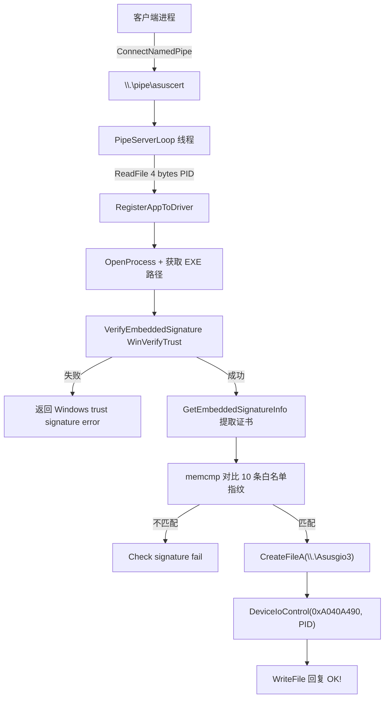

# AsusCertService.exe 逆向分析报告

## 基本信息

| 字段 | 值 |
|------|-----|
| 文件 | `AsusCertService.exe` |
| SHA256 | `050682fd3d943b791db5fdbfc08718fd08d99634b26badc6b45e4544696b0846` |
| 架构 | x64 |
| 构建路径 | `D:\Jenkins\workspace\AsIO_Driver\AsIO3\x64\Release\AsusCertService.Win32.pdb` |
| 日志路径 | `%CommonAppData%\ASUS\AsIO3\AsusCertService.exe.log` |

该二进制是 **ASUS AsIO3 驱动栈** 的配套用户态服务，与 `AsIO3.sys` 内核驱动配合工作。你的 `1.py` 正是在 `C:\Program Files (x86)\ASUS` 下按此哈希定位该文件。

---

## 一句话总结

**AsusCertService 是一个证书门控 Windows 服务**：客户端进程通过命名管道提交 PID，服务验证该进程 EXE 的 Authenticode 签名是否在白名单内，验证通过后才通过 `DeviceIoControl` 向 `AsIO3.sys` 注册该进程，使其获得与内核驱动通信的权限。

---

## 程序架构



---

## 主要功能模块

### 1. `main` — 入口与 CLI

- 启动时调用 `SetProcessMitigationPolicy(16, ...)` 设置 **映像加载缓解策略**（Arbitrary Code Guard 相关）。
- 读取注册表 `HKLM\SOFTWARE\ASUS\ARMOURY CRATE Diagnosis\EnableLog` 控制 spdlog 日志级别。
- 日志文件写入 `%CommonAppData%\ASUS\AsIO3\AsusCertService.exe.log`。

**命令行：**

| 参数 | 行为 |
|------|------|
| 无参数 | 调用 `StartServiceCtrlDispatcherW`，以 Windows 服务方式运行 |
| `install` | 创建名为 `AsusCertService` 的服务（显示名 "Asus Certificate Service"），自动启动 |
| `uninstall` | 停止并删除服务 |

### 2. `ServiceMain` — 服务主逻辑

- 注册服务控制处理器 `HandlerProc`（仅处理 `SERVICE_CONTROL_STOP`）。
- 创建命名管道：`\\.\pipe\asuscert`
  - 模式：`PIPE_ACCESS_DUPLEX | FILE_FLAG_OVERLAPPED | FILE_FLAG_FIRST_PIPE_INSTANCE`
  - 类型：`PIPE_TYPE_MESSAGE | PIPE_READMODE_MESSAGE`
  - 实例数：1，超时 5000ms
- 调用 `SetSecurityInfo` 修改管道 DACL。
- 启动工作线程执行 `PipeServerLoop`。

### 3. `PipeServerLoop` — 命名管道协议

**请求：**
1. 客户端连接 `\\.\pipe\asuscert`
2. 服务 `ReadFile` 读取 **4 字节 DWORD**，即目标进程 PID

**处理：**
- 调用 `RegisterAppToDriver(pid)`

**响应：**
- 成功：写入 UTF-16 字符串 `"OK!"`（8 字节含 null）
- 失败：不回复或管道断开

### 4. `RegisterAppToDriver` — 核心门控逻辑

```
1. OpenProcess(0x410, pid)           // PROCESS_QUERY_INFORMATION | PROCESS_VM_READ
2. K32GetModuleFileNameExW(...)      // 获取进程主模块路径
3. VerifyEmbeddedSignature(path)   // WinVerifyTrust
4. GetEmbeddedSignatureInfo(path)  // 提取 Issuer / Serial / SHA256 Fingerprint
5. 遍历白名单表 unk_14006FD70：
     memcmp(实际指纹, 白名单条目) == 0 → 通过
6. CreateFileA("\\\\.\\Asusgio3", GENERIC_READ|GENERIC_WRITE, ...)
7. DeviceIoControl(hDevice, 0xA040A490, &pid, 4, NULL, 0, ...)
```

**IOCTL 详情：**
- 设备：`\\.\Asusgio3`（AsIO3.sys 设备对象）
- IOCTL：`0xA040A490`
- 输入：4 字节 PID
- 作用：向内核驱动注册已通过签名校验的用户态进程

### 5. `VerifyEmbeddedSignature` — Authenticode 校验

- 使用 `WinVerifyTrust` + `WINTRUST_ACTION_GENERIC_VERIFY_V2` GUID
- 校验目标 EXE 的嵌入式 Authenticode 签名
- 返回 1 表示签名有效且可信

### 6. `GetEmbeddedSignatureInfo` — 证书信息提取

- `CryptQueryObject` → 打开签名存储
- `CryptMsgGetParam(CMSG_SIGNER_INFO_PARAM)` → 获取签名者信息
- `CertFindCertificateInStore` → 定位签名证书
- `CertGetNameStringW(CERT_NAME_ISSUER_FLAG)` → 提取颁发者（期望 `ASUSTeK COMPUTER INC.`）
- `CryptHashCertificate(SHA256)` → 计算证书指纹
- 输出：Issuer 宽字符串、SerialNumber 字节序列、FingerPrint SHA256

### 7. `InitAllowedCertTable` — 静态白名单初始化

- C++ 静态构造函数（`.CRT$XCU`），程序加载时执行
- 构建 **10 条** 允许的证书条目
- 每条结构约 0x50 字节，包含：
  - Issuer 宽字符串：`ASUSTeK COMPUTER INC.`
  - SerialNumber（16 或 20 字节硬编码）
  - SHA256 FingerPrint（32 字节硬编码）
- 只有指纹 **完全匹配** 白名单之一，才允许向驱动注册

---

## 安全机制与设计意图

| 机制 | 说明 |
|------|------|
| Authenticode 验证 | 必须是有效 Windows 可信签名 |
| 证书指纹白名单 | 仅允许 10 个特定 ASUS 证书签名的程序 |
| 内核驱动二次校验 | 用户态服务只是第一道门，驱动侧还有 PID 注册表 |
| 进程缓解策略 | 限制动态代码生成，提高 exploit 难度 |
| 单实例管道 | 同时只允许一个客户端连接 |

**设计目的：** 防止任意未授权进程直接打开 `\\.\Asusgio3` 并与 AsIO3 内核驱动通信（该驱动提供物理内存读写等高危 IOCTL，历史上存在多个 CVE）。

---

## 与 barevisor / kdmapper 的关系

该服务是 **ASUS 官方签名校验网关**。要加载未签名的驱动或利用 AsIO3 漏洞，通常需要：

1. 绕过或停止 `AsusCertService` 服务
2. 直接加载/leak 已签名的 `AsIO3.sys` 并与之通信
3. 或伪造/复用白名单内某合法 ASUS 程序的 PID 进行注册

你的 `1.py` 通过 SHA256 在 ASUS 安装目录定位此文件，说明你在追踪 ASUS 软件栈中的具体组件版本。

---

## IDA 中已完成的标注

### 函数重命名

| 原名称 | 新名称 |
|--------|--------|
| `sub_140012A70` | `ServiceMain` |
| `sub_140010090` | `VerifyEmbeddedSignature` |
| `sub_140010330` | `GetEmbeddedSignatureInfo` |
| `sub_1400134C0` | `RegisterAppToDriver` |
| `sub_140012E50` | `PipeServerLoop` |
| `sub_140001000` | `InitAllowedCertTable` |
| `sub_140017540` | `DisconnectAndReconnectPipe` |
| `sub_140013230` | `UninstallService` |

### 关键注释

已在 `ServiceMain`、`RegisterAppToDriver`、`VerifyEmbeddedSignature`、`PipeServerLoop`、`InitAllowedCertTable`、`main` 等地址添加功能说明注释。

---

## 分析步骤记录

1. `survey_binary` — 获取导入表、字符串、入口点概览
2. `find_regex` — 搜索 Asus/Cert/Pipe/ASIO 相关字符串
3. `py_eval` — 通过字符串 xref 定位 `main`、服务函数、注册逻辑
4. `analyze_function` — 反编译各核心函数
5. `InitAllowedCertTable` 反编译 — 发现 10 条硬编码证书白名单
6. `rename` + `set_comments` — 在 IDA 中标注分析结果

---

## 结论

`AsusCertService.exe` **不是 crackme**，没有密码/flag。它是一个 **ASUS 官方的用户态证书代理服务**，职责是：

1. 作为 Windows 服务常驻后台
2. 监听 `\\.\pipe\asuscert` 命名管道
3. 接收客户端 PID，验证其 EXE 签名是否在 10 条 ASUS 证书白名单内
4. 验证通过则 IOCTL 注册到 `AsIO3.sys` 驱动
5. 回复 `"OK!"` 表示注册成功

这是 ASUS 硬件监控/超频工具链（Armoury Crate / AI Suite / AsIO3）的安全边界组件。
