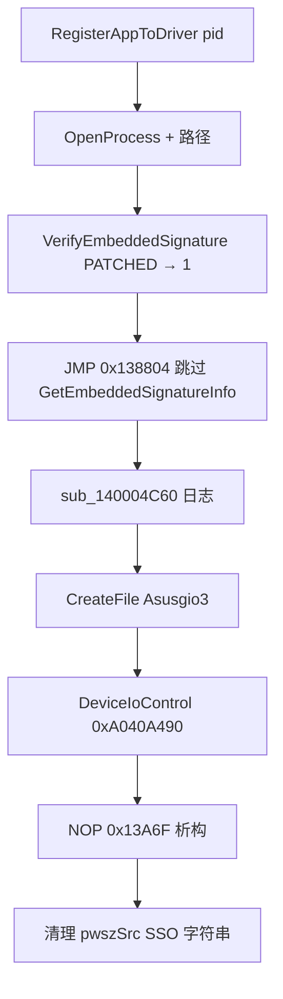

# AsusCertService Hook 验证报告

## 目标

验证 `asuscert_bypass/src/main.rs` 对运行中 `AsusCertService.exe` 的三处内存 patch 是否正确。

**二进制 SHA256：** `050682fd3d943b791db5fdbfc08718fd08d99634b26badc6b45e4544696b0846`  
**ImageBase：** `0x140000000`（与 IDA / 代码中 RVA 一致）

---

## 结论（摘要）

| Patch | RVA | 设计意图 | 结论 |
|-------|-----|----------|------|
| #1 `VerifyEmbeddedSignature` | `0x10090` | 强制返回 1，跳过 WinVerifyTrust | **正确** |
| #2 `skip_to_asio_register` | `0x135F1` | 跳过证书提取 + 白名单循环，直达 IOCTL 路径 | **错误** — 跳转目标少了一条 `call` |
| #3 `skip_v38_destructor` | `0x13A6F` | NOP 未构造对象的析构 | **正确且必要** |

整体策略（patch 运行中服务 + 可选 remote `RegisterAppToDriver`）方向正确，但 **Patch #2 的 rel32 算错**，会导致服务线程在写日志时访问非法地址并崩溃。

---

## Patch #1：VerifyEmbeddedSignature → `mov eax, 1; ret`

**地址：** `0x140010090`（RVA `0x10090`）

**原始：** 函数 prologue `48 89 5c 24 10 55 48 8d 6c 24 d0 ...`  
**Patch：** `B8 01 00 00 00 C3`（6 字节）

**调用点：** `RegisterAppToDriver` @ `0x1400135AF`

```asm
call    VerifyEmbeddedSignature
test    eax, eax
jz      loc_140013A79          ; 签名失败分支
```

Patch 后 `eax = 1`，始终走成功分支。**正确。**

---

## Patch #2：跳过 GetEmbeddedSignatureInfo + 白名单 — **存在问题**

**地址：** `0x1400135F1`（RVA `0x135F1`）

**原始：** `E8 3A CD FF FF` — `call GetEmbeddedSignatureInfo`  
**当前代码 patch：** `E9 18 02 00 00` → 落到 **`0x14001380E`**

### 问题

`0x14001380E` 是 `"ASIO_Register..."` 日志字符串的 `lea`，**前面缺少**白名单匹配成功路径开头的：

```asm
140013804  call    sub_140004C60    ; 获取 spdlog logger 单例 → rax
140013809  mov     qword ptr [rsp+490h+var_440+8], rdi
14001380E  lea     rcx, aAsioRegister
...
14001385D  mov     rcx, [rax+1D8h]  ; 依赖上一条 call 的返回值
140013864  call    sub_1400025C0
```

从 `0x135F1` 直接跳到 `0x1380E` 时：

- `rax` 仍为 Patch #1 之后留下的 **`1`**（`VerifyEmbeddedSignature` 的返回值）
- `[rax+0x1D8]` = 访问 **`0x1D9`** → **立即 AV，服务管道线程崩溃**

这与 `pipe_register` 失败时日志里提到的 *"old patch crashed the service thread"* 现象一致。

### 正确跳转目标

| 目标 VA | 说明 | rel32 | Patch 字节 |
|---------|------|-------|------------|
| `0x140013804` | 白名单匹配成功路径起点（含 logger init） | `0x20E` | **`E9 0E 02 00 00`** |
| `0x14001386C` | 跳过日志，直接 `mov rax, cs:hDevice` | `0x276` | `E9 76 02 00 00` |

**推荐：** 跳到 `0x140013804`，与正常白名单命中后的控制流完全一致。

### 控制流（修正后）



---

## Patch #3：NOP `sub_1400120D0` @ `0x13A6F`

**地址：** `0x140013A6F`（RVA `0x13A6F`）

**上下文（IOCTL 成功后）：**

```asm
140013A6B  lea     rcx, [rbp+390h+var_380]
140013A6F  call    sub_1400120D0    ; std::string 析构
140013A74  jmp     loc_1400137F6
```

`var_380` 只在白名单循环里经 `sub_140013B10` 构造。Patch #2 跳过循环后该对象**从未构造**，调用析构会崩溃。

**NOP 5 字节：** `90 90 90 90 90` — **正确且必要。**

跳转到 `0x137F6` 后的 `pwszSrc` 析构是安全的：进入 if 分支时已用 `rdi=0` + SSO 初始化清零。

---

## 其他机制验证

### RVA / 常量

| 符号 | RVA | IDA 验证 |
|------|-----|----------|
| `RegisterAppToDriver` | `0x134C0` | `0x1400134C0` ✓ |
| `VerifyEmbeddedSignature` | `0x10090` | `0x140010090` ✓ |
| IOCTL | `0xA040A490` | `DeviceIoControl` @ `0x1400139BE` ✓ |
| 设备名 | `\\.\Asusgio3` | `CreateFileA` @ `0x140013906` ✓ |

### `remote_register`（CreateRemoteThread）

`RegisterAppToDriver(DWORD)` 使用 **Microsoft x64 调用约定**，第一个参数在 **RCX**。  
`CreateRemoteThread(..., lpParameter = pid)` 在线程入口时 **RCX = pid**。**正确。**

### `serve` 代理模式

独立监听 `\\.\pipe\asuscert`，读 4 字节 PID 后直接 `DeviceIoControl` — 不依赖 patch，逻辑与原版服务一致。**正确**（需能打开 `\\.\Asusgio3` 或先 `--stop-service` 释放管道名）。

### ASLR 处理

通过 `NtQueryInformationProcess` 读 PEB `ImageBaseAddress` 再加 RVA。**正确。**

---

## 建议修改（`asuscert_bypass/src/main.rs`）

```rust
/// `jmp 0x140013804` — whitelist-match success path (includes sub_140004C60)
/// (replacing `call GetEmbeddedSignatureInfo` at RVA 0x135F1)
const PATCH_JMP_ASIO_REGISTER: [u8; 5] = [0xE9, 0x0E, 0x02, 0x00, 0x00];
```

另：`patch_remote` 使用了 `VirtualProtectEx`，但 `use` 列表中未导入该符号；若将 crate 加入 workspace 编译，需补上 import。

---

## IDA 分析步骤

1. `FetchMcpResource ida://idb/metadata` — 确认 SHA256 与 ImageBase
2. `analyze_function RegisterAppToDriver` — 反编译 + 完整汇编
3. `analyze_function VerifyEmbeddedSignature` — 确认返回值语义
4. `py_eval` — 读取三处 patch 站点原始字节、计算 rel32、反汇编 `0x13804–0x13870`
5. `set_comments` @ `0x1400135F1` — 标注正确/错误跳转目标

---

## 测试建议

```powershell
asuscert_bypass dump          # 确认三处 status: original
asuscert_bypass patch         # 应用修正后的 patch
asuscert_bypass dump          # 确认 status: patched
asuscert_bypass register --pid $PID
# 或
asuscert_bypass register --pid $PID --via-pipe
```

成功时应收到 `"OK!"` 回复，且 `%ProgramData%\ASUS\AsIO3\AsusCertService.exe.log` 中出现 `ASIO_Register...` 而非崩溃/无响应。
