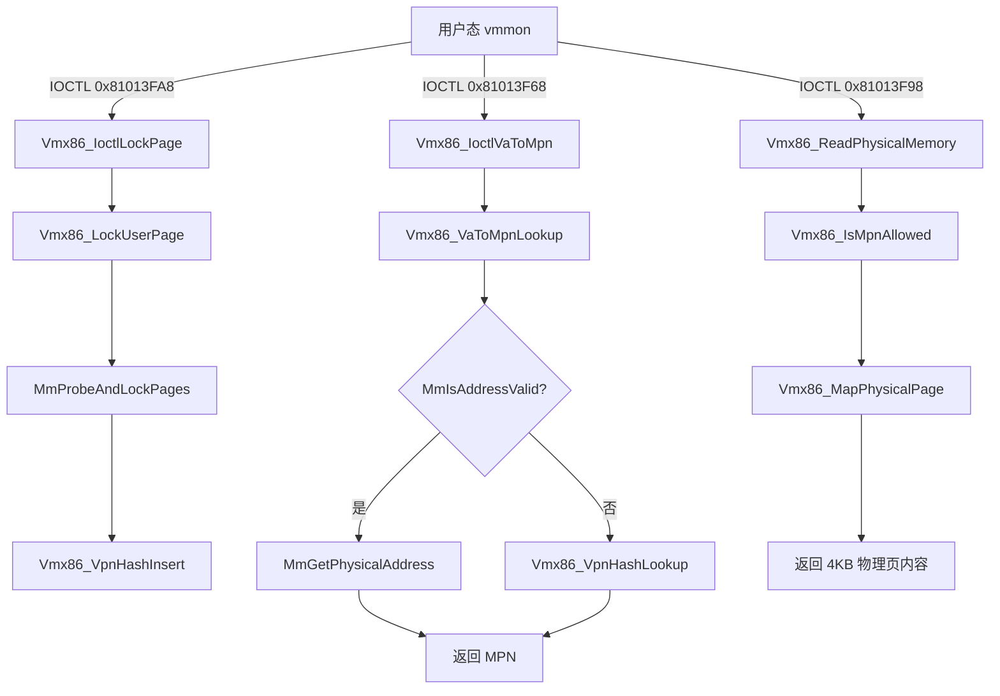

# vmx86.sys 虚拟地址 → 物理地址 分析报告

> **说明**：用户请求分析 `vmx64.sys`，但 IDA 当前加载的是 **`vmx86.sys`**（VMware Workstation/Player 内核驱动，PDB 路径含 `vmx86\phystrack.c`）。本报告基于已加载的 `vmx86.sys` 完成。若你手头另有 `vmx64.sys` 文件，请在 IDA 中打开后重新分析。

## 基本信息

| 字段 | 值 |
|------|-----|
| 文件 | `vmx86.sys` |
| IDA 数据库 | `C:\Users\Administrator\Desktop\vmx86.sys.i64` |
| SHA256 | `e8de7c03018755a37a2993b2688c5258b46919b15c5e55a85590d8ae3abf1eb3` |
| 架构 | x64 |
| 大小 | 0x23000 |
| 构建路径 | `D:\build\ob\bora-21101281\...\vmx86\phystrack.c` |
| 设备名 | `\Device\vmx86` |
| 符号链接 | `\DosDevices\vmx86` |
| 设备类型 | `0x8101` |

## 分析结论

**vmx86.sys 提供了多种“虚拟地址 → 物理页号(MPN)”机制，但并非 IOMap64 那种对任意物理地址的任意读写原语。**

核心结论：

1. **存在 VA→MPN 转换**：通过 `Vmx86_VaToMpnLookup`（`0x140006680`）实现。
2. **存在物理内存读取**：IOCTL `0x81013F98` 可按 MPN 读取最多 4KB，但需 MPN 在允许列表中。
3. **不存在面向用户态的“任意 VA→PA 并读写全系统内存”接口**；访问受 VMware vmmon 协议、页锁定注册、物理内存范围表等多重约束。
4. **该驱动不是典型 BYOVD 目标**；设备打开需通过 `CMSPAddress::get_DynamicTerminalClasses` 检查，通常仅 VMware 组件可正常使用。

---

## 驱动架构

```
DriverEntry (0x140020000)
  └── Vmx86_DriverInit (sub_140003464)
        ├── 创建设备 \Device\vmx86
        ├── 符号链接 \DosDevices\vmx86
        ├── 解析 MmMapIoSpaceEx / MmAllocateContiguousNodeMemory
        ├── Vmx86_InitPhysMemRanges() — MmGetPhysicalMemoryRanges
        └── 注册 IRP / FastIO 分发

IRP 分发:
  IRP_MJ_CREATE/CLOSE/DEVICE_CONTROL → Vmx86_DispatchIrp (0x1400047D0)
  FastIoDispatch → Vmx86_FastIoDispatch (0x140004760)
  二者均转发至 → Vmx86_HandleIoctl (0x140003BB4)
```

### 关键导入

| API | 用途 |
|-----|------|
| `MmGetPhysicalAddress` | 内核有效 VA 直接转 MPN |
| `MmGetPhysicalMemoryRanges` | 启动时建立物理内存范围表 |
| `MmMapIoSpace` / `MmMapIoSpaceEx`(动态) | 映射物理页到内核 VA |
| `MmProbeAndLockPages` | 锁定用户态页并记录 MPN |
| `ZwOpenSection` + `ZwMapViewOfSection` | 映射 `\Device\PhysicalMemory` |
| `ProbeForRead` / `ProbeForWrite` | 用户缓冲区探测 |

---

## VA → MPN 转换机制

### 1. 核心函数：`Vmx86_VaToMpnLookup` (0x140006680)

**算法（两级回退）：**

```
输入: virtualAddress
输出: MPN (物理页号, PA >> 12)

Step 1: if MmIsAddressValid(VA)
          MPN = MmGetPhysicalAddress(VA).QuadPart >> 12
          if MPN != 0 → 成功返回
        // 适用于当前 CPU 可见的内核地址

Step 2: entry = Vmx86_VpnHashLookup(vpnHash, VA >> 12)
        if entry && entry->mpn → 返回 entry->mpn
        // 适用于已通过 LockPage 注册的用户态页

否则 → 失败 (返回 -10210 / -10212 等错误码)
```

**IOCTL 封装：`Vmx86_IoctlVaToMpn` (0x14000CA28)**

- IOCTL: **`0x81013F68`**
- 输入/输出缓冲区 ≥ 12 字节
- 输入：`*Buffer` = 虚拟地址 (VA)
- 输出：`Buffer+8` = MPN；`Buffer+8` (DWORD) = NTSTATUS

### 2. 页锁定注册：`Vmx86_LockUserPage` (0x1400064BC)

通过 `MmProbeAndLockPages` 锁定用户 VA，从 MDL 提取 MPN，并插入 VPN 哈希表 (`Vmx86_VpnHashInsert`)。

- IOCTL **`0x81013FA0`** / **`0x81013FA8`** → `Vmx86_IoctlLockPage` → `Vmx86_LockUserPage`
- 只有**先锁定注册**的用户页，后续 VA→MPN 查询才能通过哈希表命中

### 3. 内部页表遍历：`Vmx86_WalkPageTables` (0x140008338)

VMware hypervisor 初始化时，通过读取 CR3/页表 MPN 逐级 walk PML4→PDPT→PD→PT，使用 `Vmx86_ReadPhysicalMemory` 读取 PTE。这是**内部 hypervisor 引导逻辑**，不是通用用户态 VA→PA 接口。

### 4. 共享区域查询：`SharedAreaVmmon_GetRegionMPN` (0x14000F660)

VMware vmmon 模块调用 (module ID `0x7C`)，按 region type / VCPU / offset 查预注册共享区的 MPN，不是通用地址转换。

---

## 物理内存访问机制

### MPN 合法性检查：`Vmx86_IsMpnAllowed` (0x140004F00)

在读/写物理页之前，检查 MPN 是否属于：

1. 物理内存范围表 `P[]`（由 `MmGetPhysicalMemoryRanges` 初始化，二分查找）
2. 已锁定页的 bitmap（`sub_1400081E8`）
3. 额外跟踪结构（`sub_140007E68`）

不在允许列表中的 MPN → 拒绝访问 (`STATUS_ACCESS_DENIED` / 0xC0000005)。

### 物理页映射：`Vmx86_MapPhysicalPage` (0x1400077F8)

```
if MPN 在允许列表:
  if MmMapIoSpaceEx 可用:
    map = MmMapIoSpaceEx(PA, 4096, flags)
  else if MPN 在物理范围表:
    map = MmMapIoSpace(PA, 4096, MmNonCached)
  else:
    open \Device\PhysicalMemory
    map = ZwMapViewOfSection(offset=MPN<<12)
else:
  return STATUS_ACCESS_VIOLATION
```

### 读物理内存

| IOCTL | 功能 | 输入 | 输出 |
|-------|------|------|------|
| **`0x81013F98`** | 按 MPN 读物理页 | `Buffer[0]` = MPN (PFN) | 最多 4096 字节到输出缓冲区 |

处理器：`Vmx86_ReadPhysicalMemory` → `Vmx86_MapPhysicalPage` → `ProbeForWrite` 拷贝。

### 写物理内存

**未发现面向 vmmon IOCTL 的物理内存写接口。**  
写操作仅存在于内部路径 `Vmx86_WritePhysicalMemory` (0x1400077A4)，供页表 patch 等 hypervisor 内部逻辑使用，同样受 `Vmx86_IsMpnAllowed` 约束。

---

## 相关 IOCTL 清单（节选）

| IOCTL | 功能 | VA/PA 相关 |
|-------|------|-----------|
| `0x81013F68` | VA → MPN 查询 | **是** |
| `0x81013F98` | 按 MPN 读物理页 (4KB) | **是（PA 侧）** |
| `0x81013FA0` / `0x81013FA8` | 锁定用户页并注册 VPN→MPN | **是（注册）** |
| `0x81013FF0` | 锁定多页 (MmProbeAndLockSelectedPages) | 间接 |
| `0x81013FF4` | 解锁并释放已映射页 | 间接 |
| `0x81013F8C` | 内存配额调整 | 否 |
| `0x81013F80` | 驱动统计信息 | 否 |
| `0x81013FB8` | 性能计数器 | 否 |
| `0x81013FD4` | VCPU 操作 | 否 |

IOCTL 传输方式：`(IoControlCode & 3) == 3` 时使用 **METHOD_NEITHER**（直接指针，FastIO 或 IRP 均支持）。

---

## 与 IOMap64.sys 的对比

| 能力 | IOMap64.sys | vmx86.sys |
|------|-------------|-----------|
| 映射任意物理地址 | ✅ 16MB/256KB 窗口 | ❌ 仅允许列表内 MPN |
| 物理内存读 | ✅ 任意偏移 | ⚠️ 仅已授权 MPN，4KB/次 |
| 物理内存写 | ✅ | ❌（无用户态 IOCTL） |
| VA → PA | ❌ | ✅ 但仅限已注册页 / 内核 VA |
| 设备访问控制 | Admin (SDDL) | VMware 组件专用检查 |
| BYOVD 风险 | **极高** | **低**（需 VMware 栈配合） |

---

## IDA 分析步骤记录

1. **`survey_binary`** — 确认模块为 vmx86.sys，发现 `phystrack.c`、`MPN`/`VPN` 字符串及 `MmGetPhysicalAddress` 导入。
2. **字符串/Xref 搜索** — 定位 `PhysTrack_*`、`SharedAreaVmmon_GetRegionMPN`、PTE 相关错误信息。
3. **DriverInit 分析** — 确认设备名、FastIO 注册、物理内存范围初始化。
4. **IOCTL 分发器 `Vmx86_HandleIoctl` 反编译** — 提取全部 `0x81013Fxx` IOCTL 分支及 handler 映射。
5. **核心函数反编译**：
   - `Vmx86_VaToMpnLookup` — VA→MPN 双路径
   - `Vmx86_MapPhysicalPage` / `Vmx86_IsMpnAllowed` — 物理访问控制
   - `Vmx86_LockUserPage` — 用户页注册
   - `Vmx86_WalkPageTables` — 内部页表遍历
6. **`int_convert`** — 将反编译中的负数 IOCTL 常量转换为 `0x81013Fxx` 格式。
7. **IDA 标注** — 重命名 18 个关键函数，添加 8 处注释。

### 已重命名函数

| 地址 | 新名称 |
|------|--------|
| 0x140003464 | Vmx86_DriverInit |
| 0x140003BB4 | Vmx86_HandleIoctl |
| 0x140004760 | Vmx86_FastIoDispatch |
| 0x1400047D0 | Vmx86_DispatchIrp |
| 0x140004F00 | Vmx86_IsMpnAllowed |
| 0x14000501C | Vmx86_MpnHashLookup |
| 0x140005618 | Vmx86_AllocTrackedPages |
| 0x1400062FC | Vmx86_InitPhysMemRanges |
| 0x1400064BC | Vmx86_LockUserPage |
| 0x140006680 | Vmx86_VaToMpnLookup |
| 0x1400067C0 | Vmx86_ReadPhysicalMemory |
| 0x1400077A4 | Vmx86_WritePhysicalMemory |
| 0x1400077F8 | Vmx86_MapPhysicalPage |
| 0x140007BC0 | Vmx86_VpnHashInsert |
| 0x140007EA4 | Vmx86_VpnHashLookup |
| 0x140008338 | Vmx86_WalkPageTables |
| 0x14000C99C | Vmx86_IoctlLockPage |
| 0x14000CA28 | Vmx86_IoctlVaToMpn |

---

## 利用/研究建议

若目标是 **barevisor / 内核研究** 场景：

1. **不能** 像 kdmapper + 漏洞驱动那样直接用 vmx86.sys 读写任意内核物理内存。
2. **可以** 通过 VMware 正常通信栈（vmmon ↔ vmx86）查询已锁定用户页的 VA→MPN。
3. 若需要通用物理内存访问，应继续使用 **IOMap64.sys** 等 BYOVD 驱动，或自行实现基于 `MmGetPhysicalAddress` 的内核模块。
4. vmx86.sys 的 PhysTrack/VPN 哈希机制对理解 **VMware 如何追踪 guest/host 页映射** 有参考价值。

---

## 附录：VA→MPN 数据流


